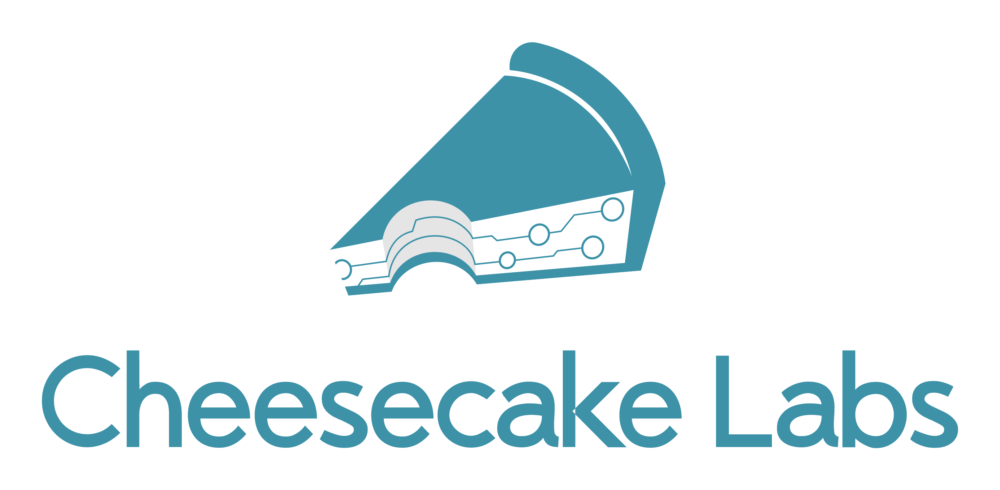

# Cake
Cake is an application that crawls over [TechCrunch](https://techcrunch.com) posts, stores data about authors, articles and provides a web API to consume it.
Why? This is a code challenge for [Cheesecake Labs](ckl.io). You know, needing a job :)

### Considerations
This is my first real project with Django and Djando REST Framework, so I had to study a lot and create this Cake in the last days. I tried to follow the recommendations and best practices available on the Internet and the documentations. With that in mind, here are some considerations:

- I didn't use GitHub's pull request and Git's branch because is a small and pretty straightforward project. 
- When collecting data with Scrapy, I tried `xpath`, `css` and even get some `ld+json` that was sitting there. I used all three to test it out.
- The crawler: In **production**, it runs the first time, collecting up to 1000 requests, which can be changed in `docker-compose-production.yml`. After that, a cron job runs every 15 minutes collecting up to 100 requests. This way things don't get out of control. In **development**, you can run the crawler as you wish.
- Collect more data with the crawler.
- Write more tests (they're never enough!).
- Use a DNS service to create an entry for the instance created.
- Improve production deployment. Here I'm experimenting with Ansible and EC2 on-the-fly, which may seen a bit raw now.

### API Endpoint
The production API endpoint can be consumed at `cake.deployeveryday.com/api/v1/`.

### Softwares used
Here's a list of softwares, libraries and servicesused in this project:
- Amazon AWS
- Ansible
- Docker
- docker-compose
- NGINX
- Django
- Django REST Framework
- Gunicorn
- PostgreSQL
- psycopg2
- Scrapy

### Architecture


### Models Reference


### Up and running: local!
It's a piece of *Cake* to run locally. Pun intended. You'll need `docker` and `docker-compose`.

Clone de repository:
```bash
git clone https://github.com/jonatasbaldin/cake.git
cd cake
```

Run docker-compose:
```bash
docker-compose build
docker-compose up -d
```

Run the crawler (here with 100 requests limit):
```bash
docker-compose run scrap scrapy crawl cake --set CLOSESPIDER_PAGECOUNT=100
```

You're ready to go! Consume the API at `http://localhost/api/v1/`.

### Up and running: production!

Clone de repository:
```bash
git clone https://github.com/jonatasbaldin/cake.git
cd cake
```

Export your AWS credentials and configure your environment:
```bash
export AWS_ACCESS_KEY_ID=<access_key>
export AWS_SECRET_ACCESS_KEY=<secret_key>

vim ansible_vars.yml
```

Run Ansible for the first time (no inventory):
```bash
ansible-playbook ansible_deploy.yml
```

The next time you run it, use the inventory file created:
```bash
ansigle-playbook -i ansible_inventory ansible_deploy.yml
```

### Thanks!
